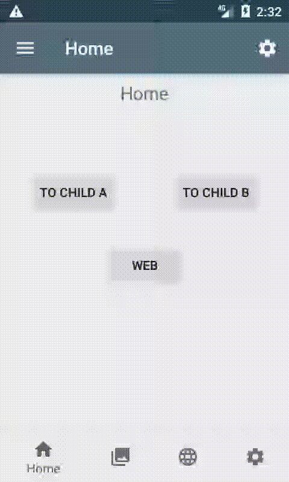

# Android Jetpack Navigation with WebView Demo

This demo project illustrates one solution on how to integrate 
[Android Navigation](https://developer.android.com/guide/navigation) with the Android 
[WebView](https://developer.android.com/reference/android/webkit/WebView) component.

You can install this demo from [Google Play](https://play.google.com/store/apps/details?id=danbroid.webnavdemo)

This link is a deeplink and will take you to the settings page when viewed in the demo.

Deep link test: https://webnavdemo/settings

The objective was to make each new page opening in the webview correspond with a new Destination in the NavGraph
so that the WebView coordinates with navigation stack.
This is done by adding a custom [Navigator](/app/src/main/java/danbroid/webnavdemo/ui/web/URLNavigator.kt) to the 
[NavController](https://developer.android.com/reference/androidx/navigation/NavController.html) in a trivial subclass of 
[NavHostFragment](/app/src/main/java/danbroid/webnavdemo/ui/web/URLNavHostFragment.kt).
This [Navigator](/app/src/main/java/danbroid/webnavdemo/ui/web/URLNavigator.kt) provides the placeholder URLDestination that
corresponds to each opening of a webpage in the [WebView fragment](/app/src/main/java/danbroid/webnavdemo/ui/web/URLNavHostFragment.kt)

